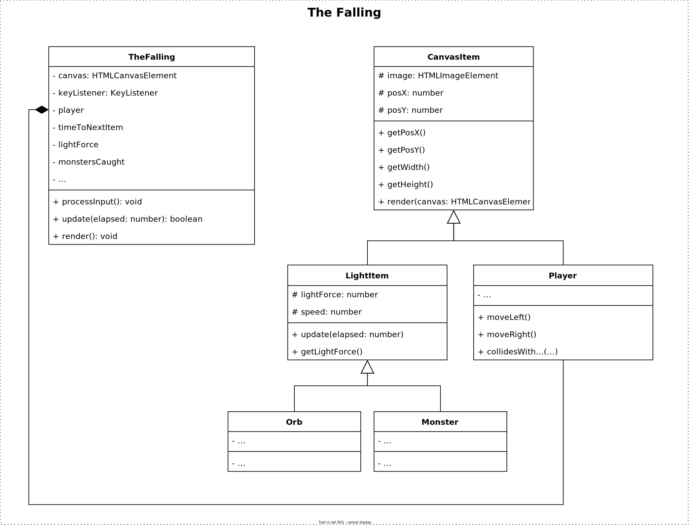

# Examen Object Oriented Programming (OOP)

| Vak | Object Oriented Programming |
|---|---|
| Code | CU75004V1 |
| Datum | 12 January 2024 |
| Tijd | 09:00 |
| Tijdsduur | 180 minuten (+extra) |
| Inleveren | Inleveren via CodeGrade |

**In geval van tegenstrijdigheid tussen de Engelse en Nederlandse versie van de instructies, geldt de Engelse versie als de definitieve en gezaghebbende bron.**

### Instructies
 - De technische vereisten voor het spel beginnen op pagina 2.
 - Download de starter .ZIP uit Learn.
 - Unzip en open de directory in je persoonlijke code editor, bijvoorbeeld Visual Studio Code.
 - Run `npm install`.
 - Implementeer de technische vereisten.
 - Run `npm run build` om de game te compileren. (Je kunt ook "watch mode" gebruiken met `npm run watch`).

### Toegestaan
 - Gebruik van je eigen laptop 

### NIET Toegestaan
 - Je mag geen gebruik maken van boeken en/of eigen notities.
 - Je mag het internet niet gebruiken als informatiebron of ter referentie
 - Je mag het internet niet gebruiken als communicatiemiddel (e-mail, Teams, Discord, posten op Stack Overflow en dergelijke).
 - Je mag geen gebruik maken van andere communicatiemiddelen zoals mobiele telefoons.
 - Je mag geen gebruik maken van of communiceren met AI diensten. In het bijzonder mag GitHub Copilot niet geïnstalleerd zijn op je IDE (Visual Studio Code).
 - Je mag geen gebruik maken van oortjes of hoofdtelefoon.
 - Je mag niet proberen om de geleverde code te deobfusceren of reverse-engineeren. 

### Inleveren
 - Je levert je code in op de bijbehorende CodeGrade.
 - Lever ENKEL je *.ts bestanden in. Als je je oplossing in meerdere mappen hebt ontwikkeld, moet je eerst een .zip van je bestanden maken.
 - Het is toegestaaan om tijdens het examen meerdere keren in te leveren.
 - CodeGrade zal alleen testen of je code succesvol compileert en de output van je ESLint. De rest van je examen wordt handmatig nagekeken.
 - De laatste inlevering wordt beschouwd als je uiteindelijke inlevering en zal beoordeeld worden.
 - De beoordelingscriteria staan op pagina 4.

<div class="page"/>

# The Falling
> Alles heeft je net ingehaald. Het voelt alsof je valt. Vallend in een afgrond.

Met behulp van je toetsenbord bestuur je het vallende personage. Terwijl je valt, raakt je LightForce op. Je moet proberen LightForce-orbs te vangen om je LightForce aan te vullen. Vermijd monsters die je LightForce zullen verslinden.

## Voorbeeld demo

Je kunt een demonstratie spelen op: [https://hz-hbo-ict.github.io/ts-thefalling/](https://hz-hbo-ict.github.io/ts-thefalling/)

## Technische Vereisten

 - Een conceptueel klassendiagram wordt meegeleverd als uitgangspunt. Maak goed gebruik van OOP-principes bij het voltooien van de implementatie.

 - De aangeleverde bestanden `GameLoop.ts`, `CanvasRenderer.ts` en `KeyListener.ts` mogen niet gewijzigd worden.

 - De speler () staat bovenaan het scherm en kan naar links of rechts bewegen met het toetsenbord.

 - De beginwaarde van de LightForce is 10.

 - Terwijl de speler "valt", daalt zijn LightForce elke seconde met 1. 

 - Willekeurig tussen 300 ms en 600 ms (milliseconden) verschijnt er een nieuwe orb of een nieuw monster aan de onderkant van het scherm, op een willekeurige plek. Een orb heeft 70% kans om te verschijnen en een monster 30%.

 - Er zijn 3 soorten orbs. Als de speler een orb vangt, voegt deze toe aan zijn LightForce. Elke bol heeft een verschillend aantal LightForce en een kans om te verschijnen:
    1. Orb Rood : 1 LightForce, 33% kans om te verschijnen
    2. Orb Groen : 3 LightForce, 33% kans om te verschijnen
    3. Orb Paars : 5 LightForce, 34% kans om te verschijnen

 - Er zijn 3 soorten monsters. Als ze de speler pakken, trekken ze een aantal LightForce af. Elke monster heeft een verschillend aantal LightForce en een kans om te verschijnen:
    1. Monster : 10 LightForce, 50% kans om te verschijnen
    2. Monster : 20 LightForce, 30% kans om te verschijnen
    3. Monster : 30 LightForce, 20% kans om te verschijnen

 - Orbs bewegen omhoog met 0.2px per verstreken ms.
 
 - Monsters bewegen omhoog tussen 0.2px en 0.4px per verstreken ms.

 - **Teleport!** Er is een kans van 20% dat een monster teleporteert als het voorbij 300px van de bovenkant van het scherm komt. Als het teleporteert, teleporteert het naar een andere plek op het scherm (zowel x- als y-positie).

 - Er wordt gezegd dat de speler een orb heeft "gevangen" of door een monster is gevangen wanneer de plaatjes tegen elkaar botsen. *De pseudocode voor botsingsdetectie staat in de digitale versie van deze instructies.*

```
Pseudocode for Collision Detection
item.X + item.width >= player.X
&& item.X <= player.X + player.width
&& item.Y + item.height >= player.Y
&& item.Y <= player.Y + player.height
```

 - Het spel is afgelopen als de LightForce van de speler minder dan 0 is of als de speler door 10 of meer monsters is gevangen.

### Conceptueel Klassendiagram


*Het is toegestaan om af te wijken van dit klassediagram, zolang de juiste principes van object georiënteerd programmeren gehandhaafd blijven.*

## Geavanceerde functionaliteit
**Besteed geen tijd aan de geavanceerde functionaliteit als de basisfunctionaliteit nog niet klaar is!**

De Cloak () beschermt de speler tegen monsters. De Cloak heeft 5% kans om te verschijnen. De Cloak beweegt diagonaal over het scherm, vanaf de onderkant tussen 0.1 en 0.3px per ms. Als de speler de cloak vangt, hebben monsters 15 seconden lang geen effect op hem (monsters hebben geen effect op de LightForce van de speler en tellen niet mee voor het totale aantal monsters dat de speler heeft gevangen). Een teller moet aangeven hoeveel seconden er nog over zijn voor de Cloak. Als de speler een tweede Cloak vangt terwijl een Cloak nog actief is, moeten de 15 seconden worden opgeteld bij de huidige timer. Er mag maar één Cloak tegelijk in beeld zijn.

Om deze functionaliteit te implementeren moet het design van een aantal klassen uitgebreid worden. Je hoeft dit design niet in te leveren.


<div class="page"/>

# Beoordelingscriteria

**Beoordelingsdrempel:** Code moet foutloos compileren met de TypeScript compiler. Als de code niet compileert, is het cijfer een 1,0. Als, naar het oordeel van de beoordelaar, de compilatiefout verholpen kan worden door minder dan 30 seconden te besteden, dan kan het nakijken doorgaan.

| Nr | Criterium | Onvoldoende | Voldoende | Goed | Uitstekend |
|---|---|---|---|---|---|
| 0 | Code compileert | Code compileert niet. (0 punten) | Code moet compileren zonder fouten van de TypeScript compiler. (10 punten) | | |
| 1 | Code kwaliteit en stijl | Stijl en kwaliteit zijn onvoldoende. ESLint fouten zijn aanwezig. (0 punten) | Types worden correct gebruikt voor variabelen, attributen en methodes. Enkele ESLint-waarschuwingen (minder dan 5). (5 punten) | Types zijn correct gebruikt. Geen ESLint-waarschuwingen, maar commentaar en documentatie onvoldoende. (7 punten) | Types worden correct gebruikt. Geen ESLint problemen. Goede kwaliteit en stijl, inclusief volledige JSDocs. (10 punten) |
| 2 | Objectgeoriënteerde programmeerprincipes en concepten | De meeste klassen ontbreken. Implementatie van de meeste klasseleden (attributen en methoden) ontbreekt. (0 punten) | Basisklassen voor functionaliteit van spel aanwezig. Alle vereiste klasseleden zijn geïmplementeerd. (10 punten) | De meeste klassen die nodig zijn voor een functioneel spel zijn aanwezig met het juiste gebruik van compositie. Abstracte klassen zijn afwezig. De meeste klasseleden communiceren op de juiste manier. (15 punten) | Klassen die nodig zijn voor een functioneel spel (geërfd en abstract) zijn aanwezig met goed gebruik van overerving en compositie. Polymorfisme wordt goed gebruikt om dubbele code te verminderen (30 punten).
| 3 | Functionaliteit van het spel | Het spel heeft weinig tot geen functionaliteit. (0 punten) | Het spel is speelbaar maar niet compleet. Functionaliteit ontbreekt. (20 punten) | Spel is in principe compleet, maar niet alle functies zijn aanwezig. (30 punten) | Spel functioneert precies zoals vereist. (40 punten)
| 4 | Geavanceerde functie | Geavanceerde functie niet geprobeerd. (0 punten) | Sporen van geavanceerde functie aanwezig, maar niet functioneel. (3 punten) | Geavanceerde functie functioneel, maar onvolledig. (6 punten) | Geavanceerde functie werkt precies zoals vereist. (10 punten)

## Credits
 - https://www.freepik.com/free-vector/falling-people-isolated-icon-set-young-adults-children-fall-from-anywhere-vector-illustration_41922694.htm
 - https://www.freepik.com/free-vector/magic-crystal-balls-fortune-teller-globes-set_34567889.htm
 - https://www.freepik.com/free-vector/flying-cartoon-monsters-set-kids-party-flying-monsters-with-wing-illustration-monster-character_13031454.htm
 - https://www.freepik.com/free-vector/cartoon-set-funny-baby-monsters_41370903.htm