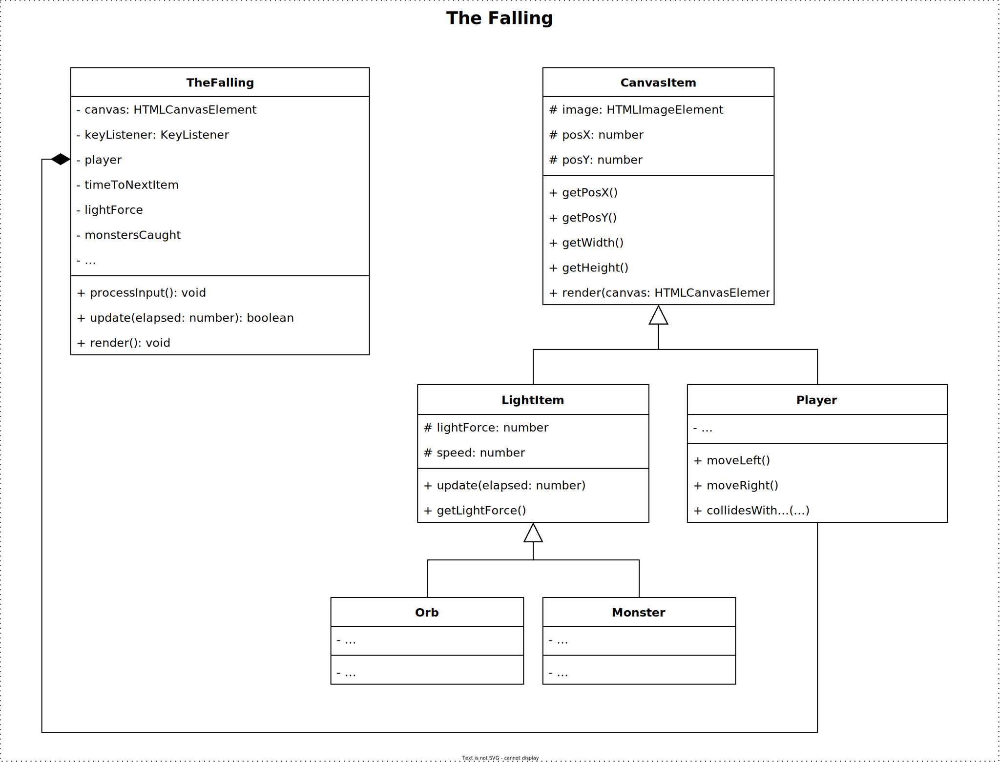

# Object Oriented Programming Case Study Exam

| Course | Object Oriented Programming |
|---|---|
| Code | CU75004V1 |
| Date | 12 January 2024 |
| Time | 09:00 |
| Duration | 180 minutes (+extra) |
| Submission | Submit on CodeGrade |

**In case of any discrepancy between the English and Dutch version of the instructions, the English version shall be considered the definitive and authoritative source.**

### Instructions
 - Read the requirements for the game, starting on Page 2.
 - Download the starter .ZIP from Learn.
 - Unzip and load the directory into your Visual Studio Code (or your IDE of choice).
 - Run `npm install`.
 - Create the implementation for the requirements.
 - To compile, run `npm run build` (you can also enter watch mode using `npm run watch`).

### Allowed
 - Use of own laptop 

### NOT Allowed
 - You may not make use of books and/or own notes.
 - You may not make use of the Internet as a source of information / reference.
 - You may not make use of the Internet as a means of communication (e-mail, Teams, Discord, posting to Stack Overflow, and similar).
 - You may not make use of any other means of communication such mobile phones.
 - You may not make use of or communicate with any AI services. In particular, GitHub Copilot may not be installed on your IDE (Visual Studio Code).
 - You may not make use of headphones.
 - You may not make attempt to deobfuscate or reverse engineer any provided code.

### Submission
 - You must submit to the dedicated CodeGrade.
 - Submit ONLY your *.ts files. If you developed your solution using multiple directories, you will need to create a .zip of your files first.
 - You are allowed to hand in multiple times during the exam. 
 - CodeGrade will only test whether you code compiles successfully and the output from your ESLint. The rest of your exam will be assessed manually.
 - The last code you handed in will be considered your final submission and will be graded.
 - The assessment rubric can be found on Page 4.

<div class="page"/>

# The Falling
> Everything has just caught up with you. It feels like you are falling. Falling into the abyss.

Using your keyboard, you control the falling character. As you are falling, your LightForce is running out. You must try to catch LightForce orbs to replenish your LightForce. Avoid monsters that will devour your LightForce. 

## Demonstration

You can play a demonstration at: [https://hz-hbo-ict.github.io/ts-thefalling/](https://hz-hbo-ict.github.io/ts-thefalling/)

## Technical Details

 - A conceptual class diagram is provided for you to start. Make good use of OOP-princples when completing the implementation.

 - You may not alter the provided `GameLoop.ts`, `CanvasRenderer.ts`, or `KeyListener.ts`.

 - The player () is on the top of the screen and can move left or right using the keyboard.

 - The initial value of the LightForce is 10.

 - As the player is "falling", their LightForce drops by 1 every second.
 
 - Randomly between 300ms and 600ms (milliseconds) either a new orb or monster will appear on the bottom side of the screen, at a random location. An orb has 70% chance of appearing and monster 30% chance of appearing.

 - There are 3 types of orbs. When the player catch an orb, it will add to their LightForce. Each orb has a different number of LightForce and a chance of appearing:
    1. Orb Red : 1 LightForce, 33% chance of appearing
    2. Orb Green : 3 LightForce, 33% chance of appearing
    3. Orb Purple : 5 LightForce, 34% chance of appearing

 - There are 3 types of monsters, if it catches the player, it will subtract a number of LightForce. Each monster has a different number of LightForce and a chance of appearing:
    1. Monster : 10 LightForce, 50% chance of appearing
    2. Monster : 20 LightForce, 30% chance of appearing
    3. Monster : 30 LightForce, 20% chance of appearing

 - Orbs move upward at 0.2px per elapsed ms.
 
 - Monsters move upward at a random speed between 0.2px and 0.4px per elapsed ms.

 - **Teleport!** There is a 20% chance that a monster will teleport when it moves past 300px from the top of the screen. If it teleports, it will teleport to different spot on the screen (both x- and y-position).

 - The player is said to have "caught" a orb or be caught by a monster when the images collide. *Pseudocode for collision detection is in the digital version of these instructions.*

```
Pseudocode for Collision Detection
item.X + item.width >= player.X
&& item.X <= player.X + player.width
&& item.Y + item.height >= player.Y
&& item.Y <= player.Y + player.height
```

 - The game is over when the player's LightForce is less than 0, or when the player has been caught by 10 or more monsters.

### Conceptual Class Diagram


*You may deviate from this given diagram, as long as you maintain good Object Oriented Programming principles.*

## Advanced Feature
**Do not spend any time on the advanced feature if your main features are not yet completed!**

The Cloak () will protect the player from monsters. The Cloak has a 5% chance of appearing. The Cloak moves diagonally across the screen, from the bottom between 0.1 and 0.3px per ms. If the player catches the Cloak, monsters will have no affect on them for 15 seconds (monsters will not affect the player's LightForce or count toward to the total number of monsters that have caught the playter). A timer must show how many seconds is left for the Cloak. If the player catches a second Cloak while a Cloak is still active, the 15 seconds must be added to the current timer. There may only be one cloak on the screen at a time.

You will have to extend the design of the classes to implement the advanced feature. You do not need to hand this in.


<div class="page"/>

# Marking Rubric

**Marking Threshold:** Code must compile without any errors from the TypeScript compiler. If the code does not compile, student will be awarded a 1.0. If, at the assessor's discretion, the compilation error can be fixed by spending less than 30 seconds, marking can continue.

| No  | Criterion | Insufficient | Sufficient | Good | Excellent |
|:-:|---|---|---|---|---|
| 0  | Code Compiles | Code does not compile. (0 pnts) | Code must compile without any errors from the TypeScript compiler. (10 pnts) |  |  |
| 1 | Code Quality & Style | Style and quality deficient. ESLint errors are present. (0 pnts) | Types are properly used for variables, attributes and methods. Some ESLint warnings (less than 5). (5 pnts) | Types are properly used. No ESLint warnings, however comments and documentation insufficient. (7 pnts) | Types are properly used. No ESLint problems. Good quality and style, including complete JSDocs. (10 pnts) |
| 2 | Object Oriented Programming Principles & Concepts    | Most classes missing. Implementation of most class members (attributes and methods) are absent. (0 pnts)    | Basic classes for functionality of game present. All required  class members are implemented. (10 pnts) | Most classes required for functional game are present with appropriate use of composition. Abstract classes are absent. Most class members appropriately communicate. (15 pnts)   | Classes required for functional game (inherited and abstract) are present with good use of inheritance and composition. Polymorphism appropriately used to reduce code duplication (30 pnts) |
| 3 | Game Functionality | Game has little to no functionality. (0 pnts) | Game is playable but not complete. Functionality is absent. (20 pnts) | Game is fundamentally complete, but not all features are present. (30 pnts) | Game functions exactly as per requirements. (40 pnts) |
| 4 | Advanced Feature | Advanced feature not attempted. (0 pnts) | Traces of advanced feature present, but not functional. (3 pnts) | Advanced feature functional, but incomplete. (6 pnts) | Advanced feature functions exactly as per requirements. (10 pnts) |

## Credits
 - https://www.freepik.com/free-vector/falling-people-isolated-icon-set-young-adults-children-fall-from-anywhere-vector-illustration_41922694.htm
 - https://www.freepik.com/free-vector/magic-crystal-balls-fortune-teller-globes-set_34567889.htm
 - https://www.freepik.com/free-vector/flying-cartoon-monsters-set-kids-party-flying-monsters-with-wing-illustration-monster-character_13031454.htm
 - https://www.freepik.com/free-vector/cartoon-set-funny-baby-monsters_41370903.htm