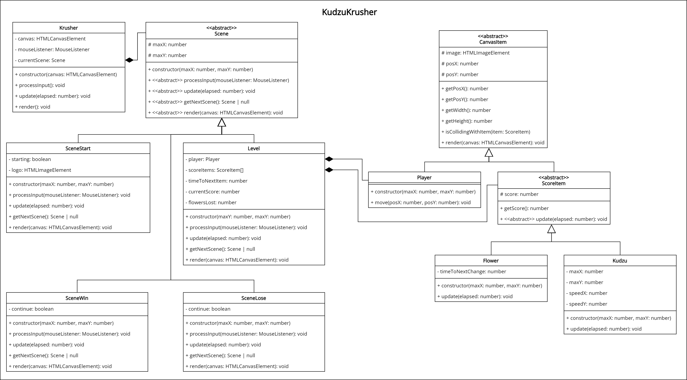

# KudzuKrusher
> Kudzu (also called Japanese arrowroot or Chinese arrowroot) is a group of climbing, coiling, and trailing deciduous perennial vines native to much of East Asia, Southeast Asia, and some Pacific islands, but invasive in many parts of the world. 

Using your keyboard, you control the hoe on the screen. Your goal is to destroy all the Kudzu on the screen. However, be careful not to hit the flowers. For every kudzu that you hit, you will get 5 points, however you will lose points when hitting a flower. Flowers become worth more (and change colours) as time progresses.

## Demonstration

You can play a [demonstration here](https://hz-hbo-ict.github.io/ts-kudzukrusher-mouse/).

## Technical Details

You must implement the game as per the class diagram given. Make good use of inheritance and polymorphism.

The game must start with a start screen. Once the clicks their left mouse button, the game will start. 

At the start of the game, 100 flowers are randomly placed on the screen. No Kudzu spawns at the beginning.

Kudzu spawns in random places on the screen. When a Kudzu spawns, it will move in a direction, and keep moving in that direction. It will wrap the screen.

The player can direct the hoe using their mouse. By clicking the player will clear the area of plants, be it flowers or Kudzu.

If the player clears Kudzu, they gain 5 points. If they clear flowers they lose points.

Flowers start of white and are worth 1 point. Once they turn blue, they are worth 3 points, worth 5 points they turn pink, and worth 7 points they turn red. Each flower increases its worth every 10-15 seconds.

As Kudzu moves over the screen, it also suffocates the flowers, making the player lose points.

Once the player gets to 100 points, they win the game. If the player has less than 0 points, the player loses the game.

Roughly every 500ms a new flower (60% chance) or new Kudzu (40% chance) spawn.

### Bonus Details

The longer a Kudzu stays on screen, the stronger it gets, requiring multiple hits before it's cleared.

Multiple Levels! More flowers! More Kudzu! MOAR FUN!!1!

## Class Diagram

## Credits
Flowers - https://opengameart.org/content/lpc-flower-recolor

Evil Kudzu - https://opengameart.org/content/ents

Background by babysofja - https://www.freepik.com/free-vector/seamless-textured-grass-natural-grass-pattern_11930799.htm