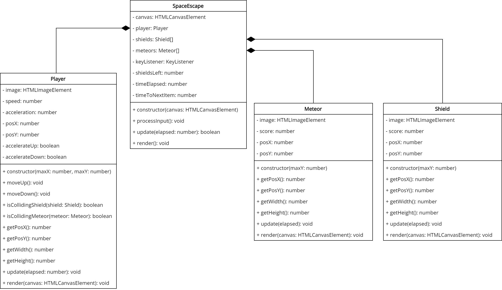
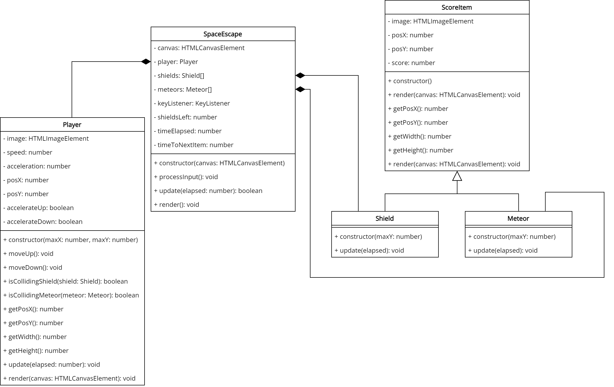
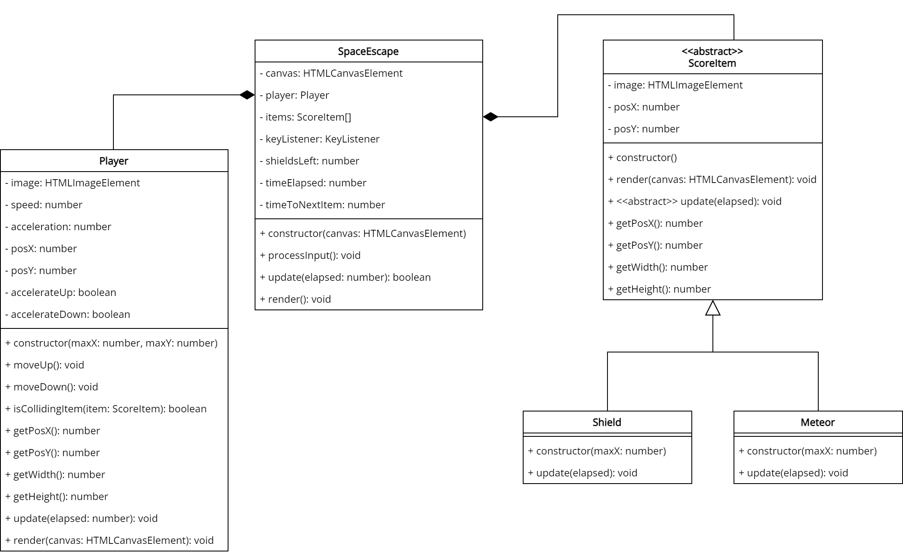

# Space Escape
> "Rouge Rogue Rover reporting. I have escaped the clutches of Admiral Zoid and making my way to the Prokro Rauch. My craft's shields are failing and I have entered the Ancient Binezodkloren of Zingangalia asteroid belt. I will need to be careful navigating my way through.

In this game, you must last as long as possible in a field of meteors. Your ship is equipped with shields, but they are failing. Every time you hit a meteor, your shields will be drained even faster. By picking up shield powerups, you can regenerate your shields ever so slightly. When your shields are completely depleted, your game is over.

## Demonstration

You can play a [demonstration here](https://hz-hbo-ict.github.io/ts-space-escape/).

## Technical Details

You must implement the game as per the class diagram given. Make good use of inheritance and polymorphism.

The player's spaceship must move up and down on the left hand of the screen, with items entering the screen from the right hand.

The ship's shields must start at about 20 and should decrease by 1 roughly every 1.5 seconds. Once the shields hit 0, the game is over.

The items coming from the right hand must be shield powerups (20%) or meteors (80%), (large (10%) and small (90%)). The shield powerups must move at a constant speed. The meteors' speed must increase as they fly, with the large meteors starting off slower than the small ones. A new item must appear roughly ever 500ms.

If a powerup hits the player, they will gain 3 shield points. If a small meteor hits the player, they will lose 1 shield point, and a large meteor they will lose 5 shield points.

The game must show the current shield level and the time that the player has been playing.

### Bonus Details

The player should not move statically. They should have enertia. The player needs to hold down the arrow, and the speed in that direction will increase (up to a limit). If the player wants to go in the opposite direction, they must first slow down their current direction.

Add a pause function.

## Class Diagram

### Inheritance

### Polymorphism

## Credits
Sprites by Kenney - https://kenney.nl

Background by Freepik - https://www.freepik.com/free-vector/cartoon-galaxy-background-with-planets_14121184.htm