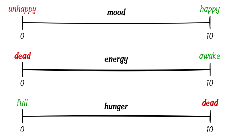
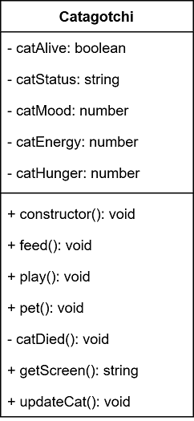
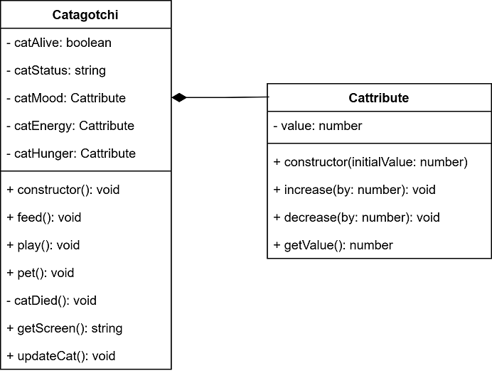

# Assignment: Classy Catagotchi

> Hi! You just spawned a new *Catagotchi*. Feed it or it will die. If you leave it, it will die. If it doesn't get enough sleep, it will die. Play with it or it will get bored and wreck your browser or format you hard drive. If you feed it too much it will get sick and ruin your computer. Have fun.

The **[Tamagotchi](https://en.wikipedia.org/wiki/Tamagotchi)** was all the rage in the late 1990s. Every child (and many adults) had have one of these virtual pets (remember fidget spinners?). Originally designed in Japan, the Tamagotchi craze quickly swept around the world. You had to feed it, play with it, and in return you could watch it grow until the battery died. Of course there were various knock-off Tamagotchis too. And that is what we will design today.

Since cats can be just as attention seeking and high maintenance as Tamagotchis, we will be designing a Catagotchi.

### Demo
Look at a [demo](https://hz-hbo-ict.github.io/ts-catagotchi/) of what you will be creating.

## Practical Cats

Catagotchi lives in your browser. As long as the page is open (and it has not died, yet) it will continue to do its thing. Catagotchi has three major attributes, namely: energy, hunger, and mood. Each of these exist on a scale of 10. 

Every game tick, Catagotchi's state will change. For example:

- If you **Play** with it, its `mood` will go up, but `energy` will go down.
- If you **Pet** it, it will fall asleep and its `energy` will go up, but `hunger` will also go up.
- If you **Feed** it, its `hunger` will go down.
- If you do nothing, its `energy` will go down, its `hunger` will go up, and its `mood` will go down.

Feel free to change and experiment as you want.

### Dramatical Cats 
Based on the Catagotchi's state, it will have a status.

Your Catagotchi will be **Okay** if 
 - **Energy** is less than 4
 - **Mood** is less than 4
 - **Hunger** is more than 6

You Catagotchi will be **Unhappy** if
 - **Energy** is less than 2
 - **Mood** is less than 2
 - **Hunger** is more than 8

Otherwise your Catagotchi is **Happy**.

If your Catagotchi's hunger reaches **10** or its energy reaches **0**, your Catagotchi will die. If the mood reaches 0, it will just be extremely unhappy.

## Pragmatical Cats

You will start by building an implementation of the Catagotchi.

### Metaphorical Cats

Use this following repository to start.

To start, run the following commands

1. Clone this repository.
2. `npm install`
3. `npm run build`

In `src/Catagotchi.ts` you will find the Catagotchi class with a couple of functions already built. In the `src/app.ts`, the most important function is the `gameTick()` function that will be called every 1.5 seconds. Here you can automate whatever needs to happen automatically.

### Classical Cats

If you are building Catagotchi in a **single class**, it must look as follows:

#### Single Class

#### Multiple Classes
However, if you are going to encapsulate the statistics in **seperate classes**, it must look as follows:

### Implementing Methods

You then need to implement the following methods:

- `feed()`, `play()`, and `sleep()`. These functions affect the Catagotchi's energy, hunger, and mood. You can decide by how much.
- `catDied()` If you Catagotchi's hunger reaches 10, or its energy reaches 0, your Catagotchi will die. This function will then need to be called.
- `updateCat()` Catagotchi getting tired? Catagotchi getting hungry? Update the relevant attributes. Also update if the cat died.
- `getScreen()`  Update the relevant display elements on the page.

## Fanatical Cats

Done already? Here are some ideas to improve your Catagotchi
- More interactions with your cat that might manipulate a more complex internal state.
- Make it more fun to play with the cat, instead of pushing a button.
- Improve visual representation of the cat and its state (for example, using images).