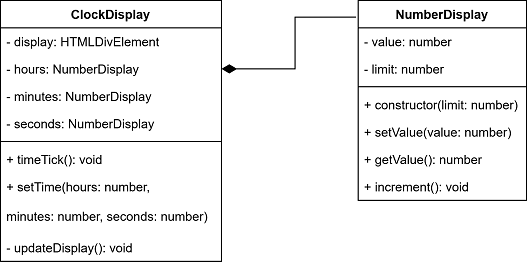

# ClockDisplay

> *Bzzzt! Bzzzt! Bzzzt!* goes the alarm. You slowly open your eyes. It's dark. Is it morning yet? you wonder as the fog of your dream slowly disappears. *Bzzzt! Bzzzt! Bzzzt!* repeats the alarm, sounding more furious than before. Your eyes adjust the light in the room and start darting across the room. The alarm on your nightstand is still screeching. Its sombre red LCDs fill the otherwise dark room with a little light. OOP! you remember suddenly and you sit up in your bed. Classes. Objects. Constructors. What does it all mean? Your alarm gives one last offended *Bzzzt!* as you smash the off-button. Good morning.

When you look at a clock, you see many parts working together. The body of the clock houses LEDs, buttons, and buzzers. All these components have their goals, a service to fulfil. In this assignment you will be creating the display of a clock: the ClockDisplay

## Instructions
You are given a ClockDisplay that does not do much.

On the main page of your ClockDisplay, you should be able to set the time, or hours, minutes, seconds, individually.

You should also be able to get the clock to tick over to the next seconds. Once the seconds reach 60, the minutes should tick over, etc.

## Class Diagram

> *Bzzzt!* You thought you were awake.