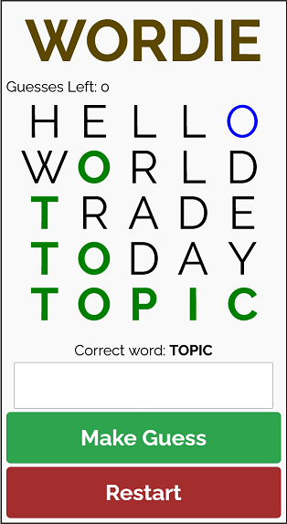
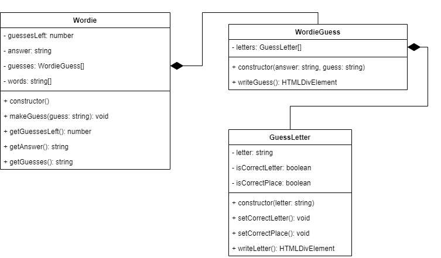

# Wordie!

A clone of the very (un)popular Wordle game.

The game starts by selecting a random word from a list of words. The player then has 5 attempts to guess the correct word. After every guess, the game shows which letter(s) are in the correct position in green, as well as which letter(s) are correct, but not in the correct location, in blue.

A playable version can be found [here](https://hz-hbo-ict.github.io/ts-wordie/)

## Class Diagram

Before looking at the class diagram below, attempt to analyse the the game and its components first.

### How it works

The player can enter a guess on the HTML form. The guess is then passed to `Wordie` class. The `Wordie` class first checks if the word that the user entered exists in its dictionary. If it does not exist, the guess is ignored.

If a valid guess is made, a new `WordieGuess` object is created with the correct answer (as known by the `Wordie` object) and the user's guess. The new `WordieGuess` object will then split the guess up into its individual letters. For each letter a new GuessLetter object is made.

The `WordieGuess` object will then determine which of the letters from the user's guess is correct. For each letter of the guess, will see if the letter exists in the correct answer and is in the correct place. If so, the `GuessLetter`'s `setCorrectPlace()` is called. Then, for the remaining letters of the correct answer, the WordieGuess will determine if the letter exists, but is only in the incorrect place. If so, the GuessLetter's `setCorrectLetter()` will be called.

When the application wants to print the guesses to the appropriate HTMLDivElement in the HTML, it will call Wordie's `getGuesses()` function that will return a string that can be put into the innerHTML of the HTMLDivElement. The getGuesses will call each of the existing `WordieGuess`s' `writeGuess()` function. The `writeGuess()` function returns a new HTMLDivElement consisting of separate HTMLDivElements obtained by each `GuessLetters`'s `writeLetter()` function. The `writeLetter()` function return a new HTMLDivElement containing the letter, and styled accordingly.