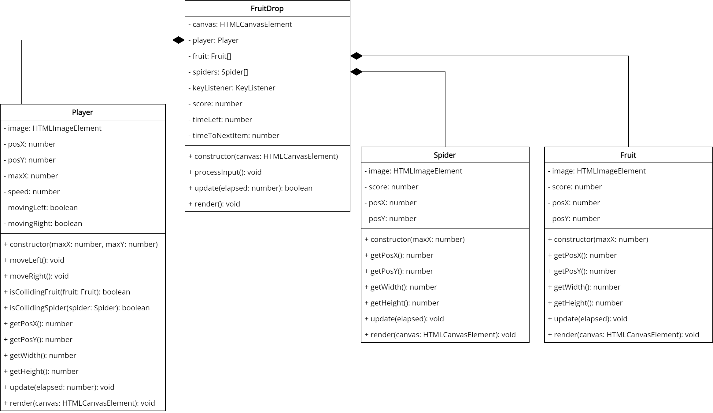
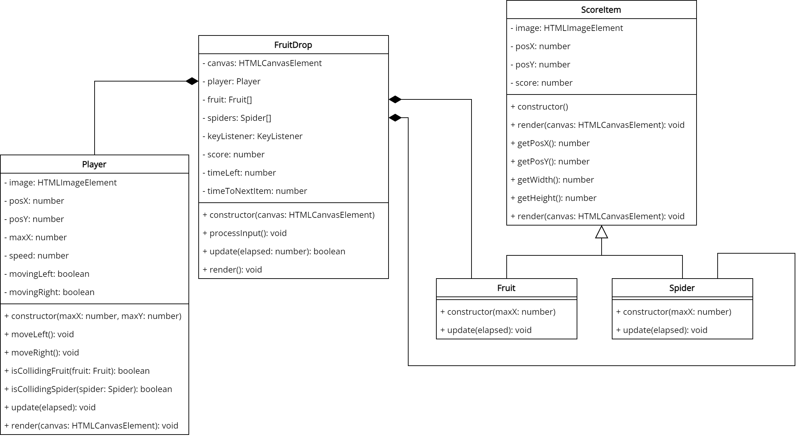
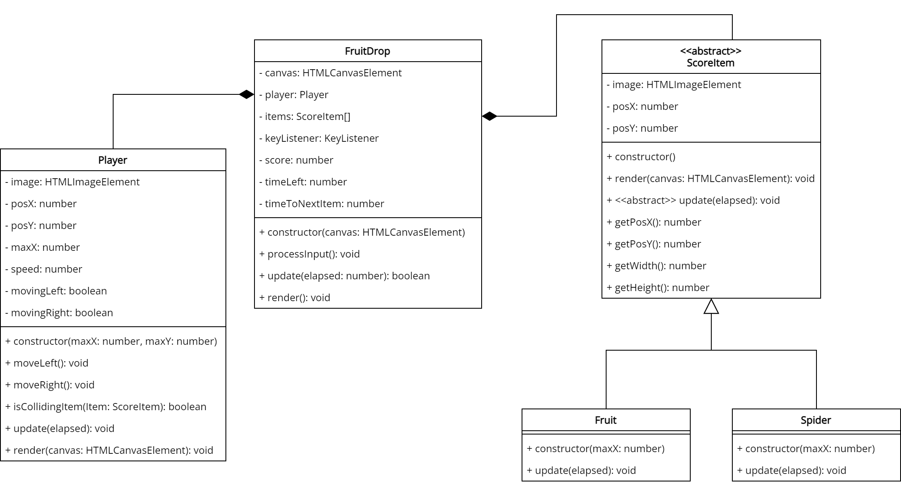

# Fruit Drop
> It's a jungle out there! The lush flora produce an abundance of fruit to eat. But, the spiders! Oh, the spiders! They're everywhere. You need to survive in the jungle.

In the game of Fruit Drop, fruit is literally falling from the treetops and it is up to you to catch as many as you can in a set amount of time. But, beware of the spiders. If you can one, you loose some of your points.

# Gameplay

The player controls a basket at the bottom of the screen. Using keyboard controls, the basket is able to move left and right at a fixed speed. Fruit will randomly appear across the the top of the screen and fall down. If the basket is under a fruit when it reaches the bottom, the fruit will be caught in the basket and the player will earn points.

At a lesser random interval, spiders will also drop from the top of the screen. If the player catches a spider, they will lose points.

## Demo
Demo is available [here](https://hz-hbo-ict.github.io/ts-fruitdrop/).

# Technical Details
The game must be drawn on a full-screen canvas.

You should make use of appropriate abstraction/encapsulation and SOLID principles to build the game. It must implement the given GameLoop class. Input must be received from the given KeyListener class. 

A single game lasts 60 seconds. At random intervals between 0 and 300 ms and new item must be spawned. There should be a 10% change that the new item is a spider, otherwise it is a fruit. When spawning, fruit and spiders must randomly select an image. The image of the fruit/spider has no bearing on the points.

Each individual fruit's speed must increase as it is falling down, starting at about 0.15 pixels per elapsed time. A spider must come down a slower, but fixed, pace of 0.1 pixels per elapsed time.

A fruit or spider is said to be caught when its image collides with the player image. When catching a fruit, the player gains points:
 - Cherries, 10% chance, 10 points
 - Strawverry, 20% chance, 7 points
 - Orange, 30% chance, 5 points
 - Grapes, 20% chance, 3 points
 - Banana, 20% chance, 1 point

When catching a spider, the player loses points:
 - Spider1, 10% chance, 5 points
 - Spider2, 20% chance, 3 points
 - Spider3, 30% chance, 2 points
 - Spider4, 40% chance, 1 point

The game must always display the current score and the time remaining. The game ends when 60 seconds have passed. A Game Over message must then be displayed. 

## Class Diagrams

### No Inheritance

### With Inheritance

### With Polymorphism

# Credits
Spiders: https://www.freepik.com/free-vector/hand-drawn-halloween-spiders-collection_18331628.htm

Fruit: https://opengameart.org/content/fruit-icons-redo

Baskets: pch.vector - https://www.freepik.com/free-vector/empty-baskets-set-wicker-boxes-hampers-containers-storage_11235372.htm

Jungle Background Dark: valadzionak_volha - https://www.freepik.com/free-vector/game-background-night-tropical-jungle_8626911.htm

