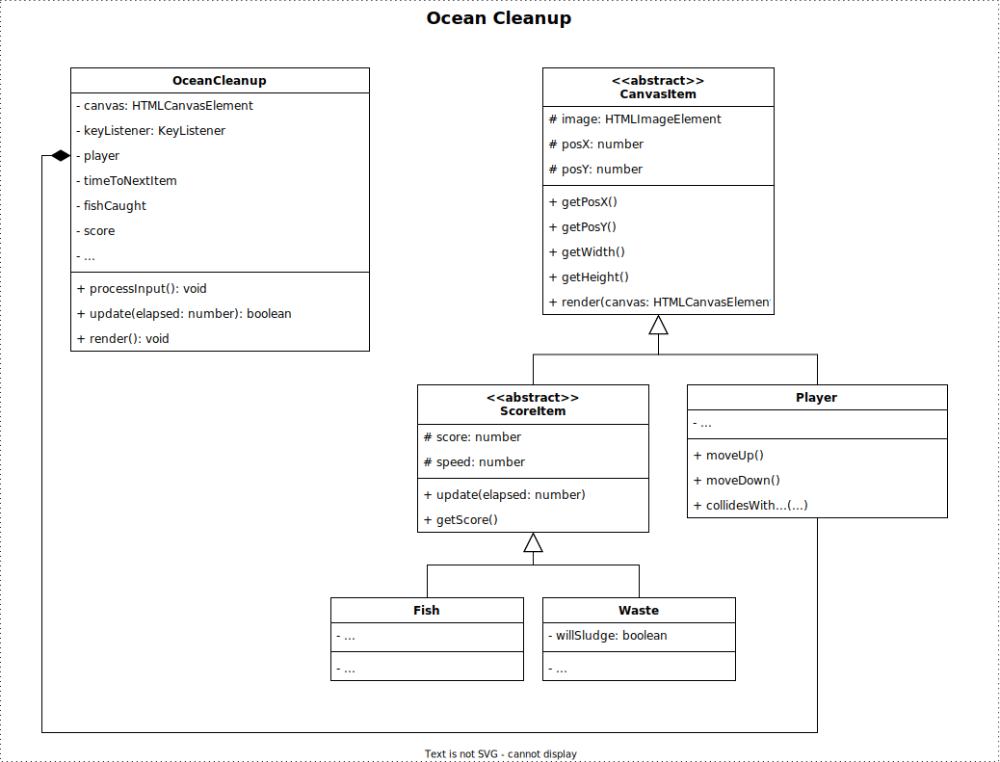

# Object Oriented Programming Case Study Exam

| Course | Object Oriented Programming |
|---|---|
| Code | CU75004V1 |
| Duration | 180 minutes (+extra) |
| Submission | Submit on CodeGrade |

### Instructions
 - Read the requirements for the game, starting on Page 2.
 - Download the starter .ZIP from Learn.
 - Unzip and load the directory into your Visual Studio Code (or your IDE of choice).
 - Run `npm install`.
 - Create the implementation for the requirements.
 - To compile, run `npm run build` (you can also enter watch mode using `npm run watch`).

### Allowed
 - Use of own laptop 

### NOT Allowed
 - Use of books and/or own notes
 - Use of the Internet as a source of information / reference
 - Use of the Internet as a means of communication (e-mail, Teams, Discord, posting to Stack Overflow, and similar)
 - Use of other means of communication like mobile phones
 - Use of headphones

### Submission
 - You must submit to the dedicated CodeGrade.
 - Submit ONLY your *.ts files.
 - You are allowed to hand in multiple times during the exam. 
 - CodeGrade will only test whether you code compiles successfully and the output from your ESLint. The rest of your exam will be assessed manually.
 - The last code you handed in will be considered your final submission and will be graded.
 - The assessment rubric can be found on Page 4.

# Ocean Cleanup
> There are 5.25 trillion pieces of plastic waste estimated to be in our oceans

Using your keyboard, you control a net in the ocean. As you try to clean up the waste, you should avoid catching any fish.

## Demonstration

You can play a [demonstration here](https://hz-hbo-ict.github.io/ts-oceancleanup/).

## Technical Details

 - A template class diagram is provided for you to start. Make good use of inheritance and polymorphism.

 - You may not alter the provided `GameLoop.ts`, `CanvasRenderer.ts`, or `KeyListener.ts`.

 - The player () is on the right side of the screen and can move up or down using the keyboard.

 - Between 300ms and 600ms (milliseconds) either a new fish or piece of waste will appear on the left-hand side of the screen, at a random location. A fish has 70% chance of appearing and waste 30% chance of appearing.

- There are 3 types of fish. Each fish has a different number of points the player will lose if caught, and a chance of appearing:
    1. Fish : -5 points, 33% chance of appearing
    2. Fish : -10 points, 33% chance of appearing
    3. Fish : -15 points, 34% chance of appearing

 - There are 3 types of waste, each will award the player a certain number of points:
    1. Waste : +10 points, 50% chance of appearing
    2. Waste : +20 points, 30% chance of appearing
    3. Waste : +30 points, 20% chance of appearing

 - Fish move at 0.2px per elapsed ms. Waste move at 0.3px per elapsed ms.

 - **Sludge!** When a piece of waste is between 400 and 450 pixels from the left of the screen, then there is a 10% chance that it will change into sludge. That piece of ordinary waste will then change into the sludge . When the player player catches the sludge, they will be awarded 100 points. The speed of sludge is 0.35px per elapsed ms.

 - The player is said to have "caught" a fish or a piece waste when the images collide.

 - The game is over when the player's score is less than 0, or when the player has caught 10 or more fish.

### Class Diagram

*You may deviate from this given diagram, as long as you maintain good Object Oriented Programming principles.*

## Advanced Feature
The Golden Capsule () can remove all waste currently in the water. The Capsule has a 5% chance of appearing and is worth 0 (nil) points. If the player catches the capsule, all waste and capsules currently on the screen will disappear and their respective points will be added to the score. In addition to moving from left to right at a rate of 0.3px per elapsed ms, the capsule also floats to the top at the rate of 0.03px per elapsed ms.

You will have to extend the design of the classes to implement the advanced feature. You do not need to hand this in.

*Do not spend too much time on the advanced feature if your main features are not completed yet!*

# Marking Rubric

**Marking Threshold:** Code must compile without any errors from the TypeScript compiler. If the code does not compile, student will be awarded a 1. If, at the marker’s discretion, the compilation error can be fixed by spending less than 30 seconds, marking can continue.

| No  | Criterion | Insufficient | Sufficient | Good | Excellent |
|:-:|---|---|---|---|---|
| 0  | Code Compiles | Code does not compile. (0 pnts) | Code must compile without any errors from the TypeScript compiler. (10 pnts) |  |  |
| 1 | Code Quality & Style | Style and quality deficient. ESLint errors are present. (0 pnts) | Types are properly used for variables, attributes and methods. Some ESLint warnings (less than 5). (5 pnts) | Types are properly used. No ESLint warnings, however comments and documentation insufficient. (7 pnts) | Types are properly used. No ESLint problems. Good quality and style, including complete JSDocs. (10 pnts) |
| 2 | Object Oriented Programming Principles & Concepts    | Most classes missing. Implementation of most class members (attributes and methods) are absent. (0 pnts)    | Basic classes for functionality of game present. All required  class members are implemented. (10 pnts) | Most classes required for functional game are present with appropriate use of composition. Abstract classes are absent. Most class members appropriately communicate. (15 pnts)   | Classes required for functional game (inherited and abstract) are present with good use of inheritance and composition. Polymorphism appropriately used to reduce code duplication (30 pnts) |
| 3 | Game Functionality | Game has little to no functionality. (0 pnts) | Game is playable but not complete. Functionality is absent. (20 pnts) | Game is fundamentally complete, but not all features are present. (30 pnts) | Game functions exactly as per requirements. (40 pnts) |
| 4 | Bonus | Bonus feature not attempted. (0 pnts) | Traces of bonus feature present, but not functional. (3 pnts) | Bonus feature functional, but incomplete. (6 pnts) | Bonus feature functions exactly as per requirements. (10 pnts) |

## Credits
 - https://www.freepik.com/free-vector/sea-background-video-conferencing_9453742.htm
 - https://www.freepik.com/free-vector/garbage-sorting-set_13146308.htm
 - https://www.freepik.com/free-vector/exotic-fish-set_4187133.htm
 - https://www.freepik.com/free-vector/slime-splashes-set_9176817.htm
 - https://www.freepik.com/free-vector/golden-capsule-fish-oil-vitamin_8368280.htm