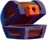
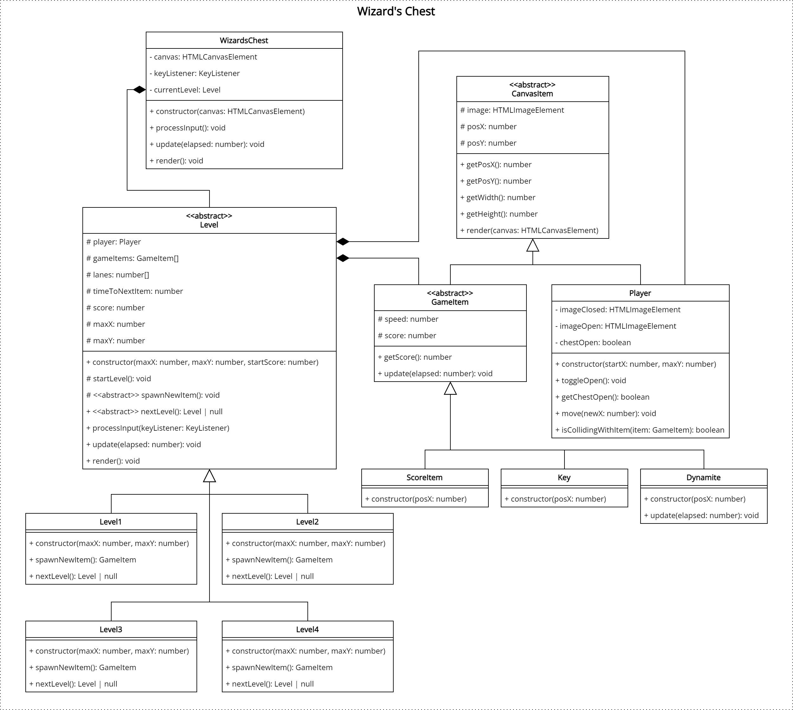

# The Wizard's Chest
> The wizard Mordak forgot to lock his magic chest and all the gems fell out. It's up to you to get them back and to prevent the evil Calvaria from getting to them.

Using your keyboard, you control a magic chest. Your progress through multiple levels to catch gems, and avoid the skulls and dynamite. You should always make sure your chest stays open!

## Demonstration

You can play a [demonstration here](https://hz-hbo-ict.github.io/ts-wizards-chest/).

## Basic Requirements

 - A template class diagram is provided for you to start. Make good use of inheritance and polymorphism.

 - You may not alter the provided `app.ts`, `Game.ts`, `CanvasRenderer.ts`, or `KeyListener.ts`.

 - The player is a chest () on the bottom of the screen and can move into fixed lanes. You can control the chest with the keyboard.

 - Between 300ms and 600ms (milliseconds) either a new game item (gem, skull, dynamite, or key depending on the level) will appear on the top of the screen, in a random lane.
 
### Score Items 
 A gem has 80% chance of appearing and a skull has 20% chance of appearing.

- There are 3 types of gems. Each gem will award the player with a different number of points, and has a chance of appearing:
    1. Red Gem : 100 points, 20% chance of appearing
    2. Green Gem : 50 points, 20% chance of appearing
    3. Blue Gem : 5 points, 60% chance of appearing

 - There are 3 skulls, each of which will lose the player a certain number of points:
    1. Red Skull : -100 points, 20% chance of appearing
    2. Green Skull : -50 points, 20% chance of appearing
    3. Blue Skull : -5 points, 60% chance of appearing

 - Gems and Skulls move at a speed of 0.2px per elapsed ms.

### Destruction
 - **Kaboom!** There is a 20% chance that a stick of dynamite () will appear. When the dynamite touches the chest, the player will lose all points (score set back to 0). 
 
 - The speed of the dynamite is 0.1px per elapsed ms, increasing by 0.005% each frame.

 - The player is said to have "caught" a gem, skull, or dynamite when the images collide.

### Keys

The magic chest can be locked and unlocked. If the chest is unlocked, it can catch gems and skulls and the player's score will be affected. Conversely, if the chest is locked, it cannot catch any gems or skulls; however dynamite is still dangerous! 

The chest can be locked and unlocked by a key () that have a 10% chance of appearing. If the chest is locked, it will be unlocked; and if it is unlocked, it will be locked.

The chest will show whether it is unlocked () or locked ().

They key moves at 0.3px per elapsed ms.

## Levels

The game must have at least 4 levels.

### Level 1
 - Only ScoreItems (gems and skulls) appear.
 - There are three lanes:
   - Lane 1: 160
   - Lane 2: 285
   - Lane 3: 410

### Level 2
 - Score needed: 500.
 - ScoreItems (gems and skulls) appear.
 - Keys can appear to lock and unlock the chest.
 - There are three lanes.

### Level 3
 - Score needed: 1000.
 - ScoreItems (gems and skulls) appear.
 - Keys can appear to lock and unlock the chest.
 - Dynamite can appear to completely clear the player's score
 - There are four lanes:
   - Lane 1: 85
   - Lane 2: 210
   - Line 3: 335
   - Lane 4: 460

### Level 4
 - Score needed: 1500.
 - ScoreItems (gems and skulls) appear.
 - Keys can appear to lock and unlock the chest.
 - Dynamite can appear to completely clear the player's score
 - There are five lanes:
   - Lane 1: 35
   - Lane 2: 160
   - Lane 3: 285
   - Lane 4: 410
   - Lane 5: 535

### Class Diagram

## Credits
 - https://www.freepik.com/free-vector/game-icons-big-set-cartoon-skull-coin-star-xp-gold-cup-clock-chest-medal-money-sack-crown-lock-key-magnet-shield-witch-potion-gift-box-crystal-parchment-vector-ui-elements_24315604.htm
 - https://www.freepik.com/free-vector/treasure-chests-closed-open-with-colour-gems_28641118.htm
 - https://www.freepik.com/free-vector/magic-school-classroom-with-cauldron-night_16646800.htm