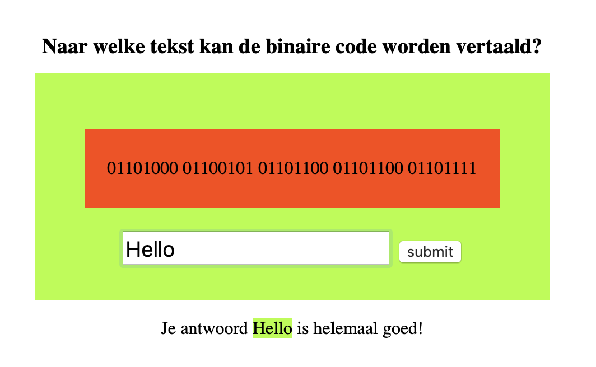

# Case study

* Start: 09.00
* End: 12.00
* Tools you are allowed to use: internet, homework assignments and examples from the course. You cannot use social media and you are not allowed to ask any anwers or code from your classmates.
* Ownership: the code you hand-in is written by you.
* You can hand-in your assignment via HZ Learn. Hand-in your project as a zip-file. 
* In case you use CodeSandBox, also hand-in an url to your answer in CodeSandBox.

## Description


Create an electronic learning environment that enables a user to learn how to translate binary into Dutch. The application works as follows. When you open the application, it shows a piece of binary code and an input form. In the input form the user fills their answer. When the users presses the submit button the application compares the users input with the expected answer. If the answer is correct, this message appears: 'Your answer {users anwser} is fully correct'. The background color of the container also changes to green as well as the background of the {users answer}. If the answer is wrong, this message appears: 'Unfortunately {users answer} is not correct, try again'. The background color of the container also changes to red as well as the background of the {users answer}. When the correct answer is provided a new random binary will be shown.

The HTML and CSS for this assignment is given in the 'start' folder.

Implement the following 4 binary questions as an array of objects.

```
Question 1:  
Question: '01101000 01100101 01101100 01101100 01101111'  
Answer: 'Hello'

Question 2:  
Question: '01010111 01100101 01101100 01101011 01101111 01101101'  
Answer: 'Welkom'

Question 3:  
Question: '01010100 01101111 01110100 00100000 01111010 01101001 01100101 01101110 01110011'  
Answer: 'Tot ziens'

Question 4:  
Question: '01000111 01110010 01101111 01100101 01110100 01101010 01100101 01110011'
Answer: 'Groetjes'
```

## Conditions

1. You can only use native Javascript, for example: you may not use jQuery.
2. Your application will only be graded when the input from the user is compared with the expected answer and a message is written to the DOM.

## Criteria

| Nr  | Criteria                                                                                     | Points |
|-----|----------------------------------------------------------------------------------------------|--------|
| 1   | Is consistent in their naming practice                                                       | 5      |
| 2   | Is using let or const in the right circumstances                                             | 5      |
| 3   | Is using an array to store (related) data                                                    | 5      |
| 4   | Is using conditionals (if/lese)                                                              | 10     |
| 5   | Is using a loop in order to avoid repeating the same steps                                   | 10     |
| 6   | Writes a function to structure code                                                          | 10     |
| 7   | Writes a function to avoid repetition (code duplication)                                     | 5      |
| 8   | Writes comments according to the AirBnB specification                                        | 5      |
| 9   | Chooses the right operator in the equations                                                  | 10     |
| 10  | Uses console.log() for debugging purposes                                                    | 5      |
| 11  | Uses higher-level functions (map, filter, reduce)                                            | 5      |
| 12  | Uses types (with TypeScript) when declaring variables (even for return types and parameters) | 5      |
| 13  | Uses a object to store structured data.                                                      | 5      |
| 14  | Uses Events for interaction                                                                  | 5      |
| 15  | Uses DOM methods (interfaces) to create and add HTML elements in the DOM.                    | 5      |
| 16  | Uses DOM methods (interfaces) to walk through the DOM                                        | 5      |

## Grading

| Appreciation           | Grade  | Points |
|------------------------|--------|---------------|
| Insufficient           | 4      | < 60          |
| Moderate insufficient  | 5      | 60 - 70       |
| Sufficient             | 6      | 70 - 80       |
| Almost good            | 7      | 80 - 85       |
| good                   | 8      | 85 - 90       |
| very goed              | 9      | 90 - 95       |
| outstanding            | 10     | 95 - 100      |