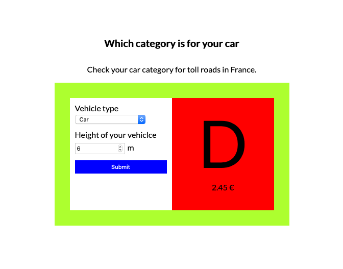

# Casustoets

* start: 09.00
* end: 12.00
* tools you are allowed to use: internet, homework assignments and examples from the course. You cannot use social media and you are not allowed to ask any anwers or code from your classmates.
* ownership: the code you hand in is written by you.
* To hand in: via learn, hand in a zip-file and a url to your answer in codesandbox.

## Casusomschrijving


Given is the HTML and CSS (see directory start) of the above mentioned image. In this image you can fill in the height and type of the vehicle. Based on this information a vehicle category and toll price is calculated. The price and category are written in the DOM. For more information about the categories see the global variable `carCategories`. When there is no matching category an error message is displayed in the `div` with the id `message`. The error message is a `p` with a class `error` and the following text: Your vehicle is to heigh for our roads.

The HTML and the CSS is given in the directory 'start'.

```javascript
//global variables
const carCategories = [
    {
        category: 'A',
        minHeight: 0,
        maxHeight: 1.8,
        price: 2.56
    },
    {
        category: 'B',
        minHeight: 1.9,
        maxHeight: 3,
        price: 3.05
    },
    {
        category: 'C',
        minHeight: 3.1,
        maxHeight: 5,
        price: 5.67
    },
    {
        category: 'D',
        minHeight: 5.1,
        maxHeight: 8,
        price: 2.45
    },
];
```

## Conditions

1. You may not use jQuery, you can only use native Javascript.
2. The application will only be graded when the values in the input are read and used in the programme, and a message is written to the DOM.

## Criteria

| Nr  | Leeropbrengsten                                                                        | Punten |
|-----|----------------------------------------------------------------------------------------|--------|
| 1   | Is consistent in their naming practice                                                 | 5      |
| 2   | Is using let or const in the right circumstances                                       | 5      |
| 3   | Is using an array to store (related) data                                              | 5      |
| 4   | Is using conditionals (if/lese)                                                        | 10     |
| 5   | Is using a loop in order to avoid repeating the same steps                             | 10     |
| 6   | Writes a function to structure code                                                    | 10     |
| 7   | Writes a function to avoid repetition (code duplication)                               | 5      |
| 8   | Writes comments according to the AirBnB specification                                  | 5      |
| 9   | Chooses the right operator in the equations                                            | 10     |
| 10  | Uses console.log() for debugging purposes                                              | 5      |
| 11  | Uses higher-level functions (map, filter, reduce)                                      | 5      |
| 12  | Uses types (with TypeScript) when declaring variables (even for return types and parameters)                                                                                    | 5      |
| 13  | Uses a object to store structured data.                                                | 5      |
| 14  | Uses Events for interaction                                                            | 5      |
| 15  | Uses DOM methods (interfaces) to create and add HTML elements in the DOM.              | 5      |
| 16  | Uses DOM methods (interfaces) to walk through the DOM                                  | 5      |

## Grading

| Appreciation           | Grade | Points |
|------------------------|--------|---------------|
| Insufficient           | 4      | < 60          |
| Moderate insufficient  | 5      | 60 - 70       |
| Sufficient             | 6      | 70 - 80       |
| Almost good            | 7      | 80 - 85       |
| good                   | 8      | 85 - 90       |
| very goed              | 9      | 90 - 95       |
| outstanding            | 10     | 95 - 100      |