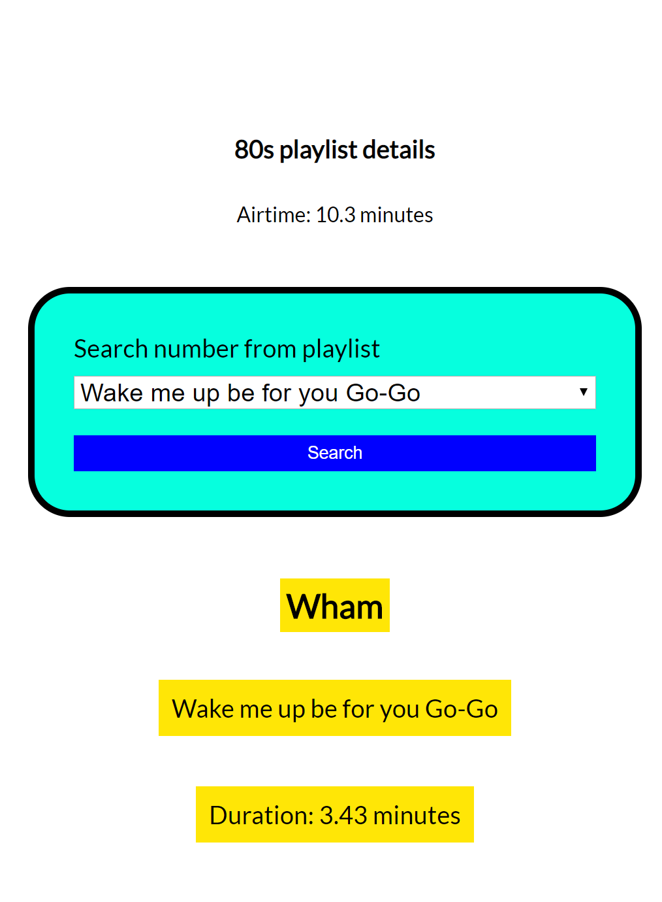

# Case study

* start: 09.00
* end: 12.00
* tools you are allowed to use: internet, homework assignments and examples from the course. You cannot use social media and you are not allowed to ask any anwers or code from your classmates.
* ownership: the code you hand in is written by you.
* To hand in: via learn, hand in a zip-file and a url to your answer in codesandbox.

## description



Given is the HTML and CSS in the directory `start` and the picture above. In this picture you can see a overview of our favorite 80s playlist. Beneath the title you can find the airtime of that playlist. The airtime is the sum of the duration of each song. You have to calculate that with JavaScript and place it in the right spot of the DOM. The current airtime is a dummy placeholder.

With the form you can select a song from the playlist. If you select the song and click on submit (search) the details of that song will be shown in the `div` with the id `number-details`. You have to add the details to the DOM using the following HTML.

```javascript
<h1 id="artist" class="bg-yellow">name-of-artist</h1>
<p id="number" class="bg-yellow">name-of-the-song</p>
<p id="duration" class="bg-yellow">duration-of-the-song</p>
```

The HTML and the CSS is given in the directory 'start'.

All songs form the playlist are structured in the following array of songs.

```javascript
//global variables
const myPlayList = {
    name: 'My Favourite 80s tracks',
    numbers: [
        {
            name: 'Wake me up be for you Go-Go',
            duration: 3.43,
            artist: 'Wham'
        },
        {
            name: 'Never gonna give you up',
            duration: 3.30,
            artist: 'Rick Astley'
        },
        {
            name: 'The final countdown',
            duration: 3.57,
            artist: 'Europa'
        }
    ]
}
```

## Conditions

1. You may not use jQuery, you can only use native Javascript.
2. The application will only be graded when the values in the input are read and used in the programme, and a message is written to the DOM.

## Criteria

| Nr  | Leeropbrengsten                                                                        | Punten |
|-----|----------------------------------------------------------------------------------------|--------|
| 1   | Is consistent in their naming practice                                                 | 5      |
| 2   | Is using let or const in the right circumstances                                       | 5      |
| 3   | Is using an array to store (related) data                                              | 5      |
| 4   | Is using conditionals (if/lese)                                                        | 10     |
| 5   | Is using a loop in order to avoid repeating the same steps                             | 10     |
| 6   | Writes a function to structure code                                                    | 10     |
| 7   | Writes a function to avoid repetition (code duplication)                               | 5      |
| 8   | Writes comments according to the AirBnB specification                                  | 5      |
| 9   | Chooses the right operator in the equations                                            | 10     |
| 10  | Uses console.log() for debugging purposes                                              | 5      |
| 11  | Uses higher-level functions (map, filter, reduce)                                      | 5      |
| 12  | Uses types (with TypeScript) when declaring variables (even for return types and parameters)                                                                                    | 5      |
| 13  | Uses a object to store structured data.                                                | 5      |
| 14  | Uses Events for interaction                                                            | 5      |
| 15  | Uses DOM methods (interfaces) to create and add HTML elements in the DOM.              | 5      |
| 16  | Uses DOM methods (interfaces) to walk through the DOM                                  | 5      |

## Grading

| Appreciation           | Grade | Points |
|------------------------|--------|---------------|
| Insufficient           | 4      | < 60          |
| Moderate insufficient  | 5      | 60 - 70       |
| Sufficient             | 6      | 70 - 80       |
| Almost good            | 7      | 80 - 85       |
| good                   | 8      | 85 - 90       |
| very goed              | 9      | 90 - 95       |
| outstanding            | 10     | 95 - 100      |