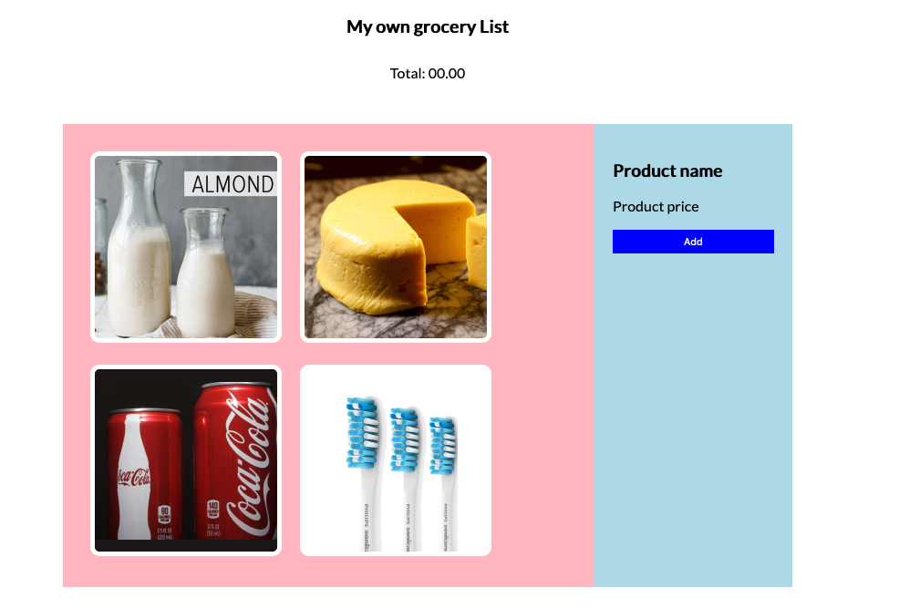

# Case study

* Start: 09.00
* End: 12.00
* Some students are entitled to have some extra time. They all have 20% extra time, for this exam it is 36 minutes in total. You can hand the answers in until 12.36.
* Tools you are allowed to use: internet, homework assignments and examples from the course. You cannot use social media and you are not allowed to ask any anwers or code from your classmates.
* Ownership: the code you hand-in is written by you.
* You can hand-in your assignment via HZ Learn. Hand-in your project as a zip-file. 
* In case you use CodeSandBox, also hand-in an url to your answer in CodeSandBox.
* You can use the following template for CodeSandBox: <https://codesandbox.io/s/programming-bascis-template-updated-2ht13>


## Description



Given is the HTML and CSS in the directory `start` and the picture above. In this picture you can see an overview of the inventory of a grocery store.

The inventory (the images) should be dynamically added to the DOM based on the object array `allGroceryProducts`.
 
When a picture is clicked the details of that product (details are found in the object array) should be shown in the blue sidebar. The name of the product should be shown in the `h3` element with the id `groceryName` and the price in the `p` element with the id `groceryPrice`. 

When the add button is clicked the price of the chosen product should be added to the total in the `span` element with the id `totalPrice`, just under the title 'My own groceryList`.


## Suggested steps

1. Add all the images to the DOM from the object-array `products`.
```javascript
//global variables
const allGroceryProducts = {
  name: "Grocery inventory list",
  products: [
    {
      product: "Milk",
      image: "milk.png",
      price: 1.89,
    },
    {
      product: "Cheese",
      image: "cheese.png",
      price: 3.49,
    },
    {
      product: "Coca cola",
      image: "coca-cola.png",
      price: 0.89,
    },
    {
      product: "Tooth brush",
      image: "toothe-brush.png",
      price: 8.99,
    },
  ],
};
```

You can use the following HTML structure as a reference.
```html

```

2. Make sure you can click on the images and the `alt` of the clicked image is shown in the console.
3. Make sure when you click an image the details of the image are retrieved from the object array.
4. Make sure when you click an image the details are written to the DOM. The price should be written in the `p` element with id `groceryPrice` and product to an `h3` element with the id `groceryName`. Both elements are alreay in the DOM in your `start` directory.
5. When the add button is clicked make sure that the price in the `p` element with id `groceryPrice` is added to the total price. Also take into account that your application doesn't produce an error when this element does not contain a number.
6. Add the total price to the DOM in the `span` element with the id `totalPrice`.

The HTML and the CSS is given in the directory 'start'. You don't need to make changes in the CSS to match your application with the provided reference picture above.

## Conditions

1. You can only use native Javascript, for example: you may not use jQuery.
2. The application will only be graded when the images in the DOM are clickable

## Criteria

| Nr  | Criteria                                                                                     | Points |
|-----|----------------------------------------------------------------------------------------------|--------|
| 1   | Is consistent in their naming practice                                                       | 5      |
| 2   | Is using let or const in the right circumstances                                             | 5      |
| 3   | Is using an array to store (related) data                                                    | 5      |
| 4   | Is using conditionals (if/lese)                                                              | 10     |
| 5   | Is using a loop in order to avoid repeating the same steps                                   | 10     |
| 6   | Writes a function to structure code                                                          | 10     |
| 7   | Writes a function to avoid repetition (code duplication)                                     | 5      |
| 8   | Writes comments according to the AirBnB specification                                        | 5      |
| 9   | Chooses the right operator in the equations                                                  | 10     |
| 10  | Uses console.log() for debugging purposes                                                    | 5      |
| 11  | Uses higher-level functions (map, filter, reduce)                                            | 5      |
| 12  | Uses types (with TypeScript) when declaring variables (even for return types and parameters) | 5      |
| 13  | Uses a object to store structured data.                                                      | 5      |
| 14  | Uses Events for interaction                                                                  | 5      |
| 15  | Uses DOM methods (interfaces) to create and add HTML elements in the DOM.                    | 5      |
| 16  | Uses DOM methods (interfaces) to walk through the DOM                                        | 5      |

## Grading

| Appreciation           | Grade  | Points |
|------------------------|--------|---------------|
| Insufficient           | 4      | < 60          |
| Moderate insufficient  | 5      | 60 - 70       |
| Sufficient             | 6      | 70 - 80       |
| Almost good            | 7      | 80 - 85       |
| good                   | 8      | 85 - 90       |
| very good              | 9      | 90 - 95       |
| outstanding            | 10     | 95 - 100      |